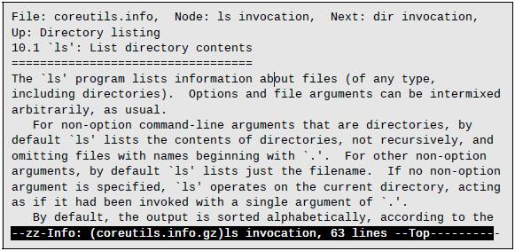

# 5. 用命令工作

目前为止，我们看到了一系列迷一样的命令，每个命令各自有一套迷一样的选项和参数。在本章，我们会尝试抹去一些谜团，甚至会创建我们自己的命令。将在本章中介绍的命令有：

- `type` 指示如何解释命令名称
- `which` 显示哪一个可执行程序将被执行
- `help` 得到 shell 内建的帮助信息
- `man` 显示一个命令的<u>手册页</u>（*manual page*）
- `apropos` 显示适用的命令列表
- `info` 显示一个命令的信息
- `whatis` 显示一行手册页描述
- `alias` 创建一个命令的别名

## 命令究竟是什么？

一个命令可以是下列四种不同事物中的一个：

1. **一个可执行程序**。如我们在 `/usr/bin` 中所见到的那些文件。在那个目录中，用 C 和 C++ 所写的，或者那些用<u>脚本语言</u>（*scripting language* 如 shell，Perl，Python，Ruby 等等）所写的程序可以被编译成二进制文件。
2. **一个 shell 内建的命令**。`bash` 内部支持的一些命令，称为 <u>shell 内建命令</u>（*shell builtins*），例如 `cd` 就是其中一个。
3. **一个 shell 函数**。shell 函数是被纳入<u>环境</u>（*environment*）中的微型 shell 脚本。我们将在后续章节中学习如何配置环境、如何编写 shell 函数。现在我们只要知道它们存在就行了。
4. **一个别名**。别名是我们自己从其它命令定义的命令。

## 识别命令

知道所用的命令是四者中的哪个类型，通常是很有用的，而 Linux 也提供了一些途径去识别。

### type - 显示命令类型

`type` 命令是一个 shell 内建命令，用以根据给出的命令名称，显示 shell 将执行的命令的类型。用法如下：

```
type command
```

「command」是我们想要检查的命令的名称。下面是一些范例：

```bash
[me@linuxbox ~]$ type type
type is a shell builtin
[me@linuxbox ~]$ type ls
ls is aliased to `ls --color=tty'
[me@linuxbox ~]$ type cp
cp is /bin/cp
```

这里我们看到三种不同的命令。注意 `ls`（上例取自 Fedora 系统），`ls` 实际上是 `ls` 命令外加 `--color=tty` 选项的一个别名。现在我们知道了为什么 `ls` 输出结果的时候会显示不同的颜色了！

### which - 显示可执行程序的位置

系统中有时候会安装一个可执行程序的多个版本。这在桌面系统中不常见，但是在大型服务器上却不罕见。要确定所给出的可执行程序的确切位置，就要用到 `which` 命令。

```bash
[me@linuxbox ~]$ which ls
/bin/ls
```

`which` 仅仅为可执行程序服务，不为内建命令、也不为替代实际可执行程序的别名服务。当我们尝试用 `which` 检查一个内建命令如 `cd` 时，要么没有反馈，要么得到一个错误信息。

```bash
[me@linuxbox ~]$ which cd
/usr/bin/which: no cd in (/usr/local/bin:/usr/bin:/bin:/usr/local/games:/usr/games)
```

这样的反馈是一种「找不到命令」的花哨的说法。

## 得到命令的文档

通过对命令的了解，我们现在可以搜索可用于各种命令的文档。

### help - 得到内建命令的帮助文档

`bash` 为每个 shell 内建命令提供了一个内建的帮助文档。键入`help` 后跟内建命令的名称，即可得到。示例如下：

```bash
[me@linuxbox ~]$ help cd
cd: cd [-L|[-P [-e]] [-@]] [dir]
    Change the shell working directory.

    Change the current directory to DIR...（译者从略）
```

**关于符号的注释**：一个命令的句法中如果出现<u>方括号</u>（square brackets `[]`），意指为可选项（optional items） 。<u>竖条字符</u>（vertical bar character `|`）意指互斥项（mutually exclusive items）。如上 `cd` 命令中所示：

```bash
cd [-L|[-P[-e]]] [dir]
```

这个符号是说，`cd` 后可选择性的跟随 `-L` 或 `-P`，更进一步，如果指定了 `-P` 选项，也可以包含 `-e` 选项，随后是一个可选的参数 `dir`。

`cd` 命令的 `help` 输出的内容简洁准确，但如我们看到的，这并非入门教程，还有很多内容我们没有提到。别担心，会有的。

### --help - 显示用法信息

许多可执行程序支持 `--help` 选项以显示关于命令所支持的句法和选项。例如：

```bash
[me@linuxbox ~]$ mkdir --help
Usage: mkdir [OPTION] DIRECTORY...
Create the DIRECTORY(ies), if they do not already exist.

  -Z, --context=CONTEXT (SELinux) set security context to CONTEXT Mandatory arguments to long options are mandatory for short options too. （译者从略）
```

有些程序并不支持 `--help` 选项，不过无论有没有，都试试。通常，一些错误信息里也会提供同样用途的信息。

### man - 显示程序的手册页

大多数可执行程序会为命令行提供一个正规的文档，叫做「手册页」（*manual* 或 *man page*）。一个专门的分页程序 `man` 用来查看这些文档。用法如下：

```bash
man program
```

其中 `program` 即要查看的命令的名称。

手册页有各种格式，但是一般会包含下列内容：

- 标题（页面名称）
- 关于命令句法的简介
- 命令功能的简述
- 关于命令选项的描述清单

不过手册页通常是作为一个参考而非教程，且不包含示例。例如 `ls` 的手册页：

```bash
[me@linuxbox ~]$ man ls
```

大多数 Linux 系统中，`man` 使用 `less` 来显示手册页，所以在手册页中的所有操作，大多和 `less` 命令仿佛。

`man` 所显示的「手册」被分为几个章节，不仅包括用户命令，还包括系统管理命令，编程接口，文件格式等。表 5-1 描述了手册页的章节布局。

| 章节 | 内容                           |
| :--: | ------------------------------ |
|  1   | 用户命令                       |
|  2   | 供核心系统呼叫的程序界面       |
|  3   | C 语言库的程序界面             |
|  4   | 特殊文件，如设备节点和驱动程序 |
|  5   | 文件格式                       |
|  6   | 游戏和娱乐，如屏幕保护程序     |
|  7   | 杂项                           |
|  8   | 系统管理员命令                 |

有时候我们需要指定章节，以便找到我们所需的手册页。尤其是当我们在查找一个既是文件格式又是命令名称的关键词的时候。没有指定章节编号，我们将只能得到第一个匹配的实例，很可能在第 1 节中。要指定章节号，我们可以这样键入命令：

```bash
man section search_term
```

例如：

```bash
[me@linuxbox ~]$ man 5 passwd
```

这个命令将显示描述 `/etc/passwd` 文件格式的手册页。

### apropos - 显示合适的命令

也可以基于要检索的条目，查询可能匹配的手册页清单。这样做虽然很粗疏，但是有时候很有用。如用 *partition* 检索手册页的示例：

```bash
[me@linuxbox ~]$ apropos partiton
addpart (8)   - simple wrapper around the "add partition"...
all-swaps (7) - event signalling that all swap partitions...
（译者从略）
```

每行中的第一个字段，是手册页的名称，在括号中的第二个字段是手册页的章节号。记住，在 `man` 命令中加 `-k` 选项，可以得到 `apropos` 命令同样的功能。

### whatis - 显示一行手册页描述

`whatis` 程序显示匹配于给定关键词的一行手册页描述：

```bash
[me@linuxbox ~]$ whatis ls
ls  (1)  - list directory contents
```

> **最野蛮的手册页**
>
> 如我们所见，手册页提供了作为 Linux 和类 Unix 系统的参考文档而非教程。很多手册页都很难读，但是我认为最难的是 `bash` 的手册页。当我正在为本书而研究时，我仔细复习了 `bash` 的手册页，确保自己涵盖了大多数主题。打印出的文档超过 80 页，且极其晦涩难解，对于新手而言，这样的文档结构毫无意义。
>
> 另一方面，它又非常准确简洁，也极其完善。所以如果你敢于尝试，当你能读懂它的时候，它的意义就凸显出来了。

### info - 显示程序的信息条目

GNU 项目为他们的程序提供一个手册页的替代品，「info」。Info 手册用 `info` 阅读程序来显示。Info 页面是类似网页超链接的文本。样式如下：



`info` 程序阅读的是一个个独立<u>节点</u>（*nodes*），每个节点包含一个独立主题的 <u>info 文件</u>（*info files*）。Info 文件包含超链接，能够从文档中的一个节点跳转到另一个节点。超链接以其前面的星号（`*`）标识，并通过将光标放在其上并按Enter键来激活。

要调用 `info`，键入 `info` 并以程序名为可选参数。表 5-2 描述了用来控制显示 `info` 页面的阅读器的命令。

表 5-2 info 命令

| 命令                  | 行为                                |
| --------------------- | ----------------------------------- |
| `?`                   | 显示命令帮助                        |
| `PgUp` 或 `Backspace` | 显示上一页                          |
| `PgDn` 或 `Space`     | 显示下一页                          |
| `n`                   | 显示下一个节点                      |
| `p`                   | 显示上一个节点                      |
| `u`                   | Up 显示父节点，通常情况下是一个菜单 |
| `Enter`               | 打开光标位置上的超链接              |
| `q`                   | 退出阅读器                          |

目前为止，我们所讨论的命令都是 GNU 项目中的 *coreutils* 软件包，所以键入下列命令：

```bash
[me@linuxbox ~]$ info coreutils
```

将显示一个带有超链接的菜单页，包含该软件包中的每个程序。

### README 和其它程序文档文件

很多安装在系统中的软件包，都会在 `/usr/share/doc` 目录中存放文档文件。大多数以纯纹板格式存储，能够用 `less` 查看。有些文件则用 `html` 格式，能用网页浏览器打开。我们也会遇到用 `.gz` 扩展名结尾的文件，表明它们是用 `gzip` 压缩程序压缩而成。`gzip` 包会包含一个特殊版本的 `less` 程序——`zless`，能显示经由 `gzip` 压缩的文本文件。

## 用 alias 创建我们自己的命令

现在，让我们体验初次编程吧！我们将用 `alias` 命令创建一个属于我们自己的命令。在开始之前，我们来揭示一个命令行的小技巧。我们可以将多个命令放置在一行命令中，并以分号（`;`）分隔。像这样：

```bash
command1; command2; command3...
```

例如：

```bash
[me@linuxbox ~]$ cd /usr; ls; cd -
bin games include lib local sbin share src
/home/me
[me@linuxbox ~]$
```

如所见，我们把三个命令放在一行中执行。首先切换目录到 `/usr`，然后列出目录中的内容，最后用 `cd -` 回到原来的目录。这样我们结束命令的时候，又回到了命令开始的所在。现在让我们用 `alias` 命令将这个系列命令变成一个新的命令。首先，我们要想出一个新命令的名字，让我们试着用 `test` 这个名字。在尝试之前，检查一下 `test` 这个名字是否被使用，是个好习惯。我们用 `type` 命令检查：

```bash
[me@linuxbox ~]$ type test
test is a shell builtin
```

糟糕，`test` 已经被占用了。来试试 `foo`：

```bash
[me@linuxbox ~]$ type foo
bash: type: foo: not found
```

好！`foo` 命令可用。来创建我们的别名程序：

```bash
[me@linuxbox ~]$ alias foo='cd /usr; ls; cd -'
```

注意命令的结构是这样的：

```bash
alias name='string'
```

在 `alias` 之后，我们给出别名，并紧跟着（不允许有空白字符）一个等于号（`=`），随后是用引号包括的文本。在我们定义了别名之后，我们可以在 shell 中随意使用这个命令。来试一试：

```bash
[me@linuxbox ~]$ foo
bin games include lib local sbin share src
/home/me
[me@linuxbox ~]$
```

用 `type` 命令来查看一下我们的别名：

```bash
[me@linuxbox ~]$ type foo
foo is aliased to `cd /usr; ls; cd -'
```

要移除别名，用 `unalias` 命令：

```bash
[me@linuxbox ~]$ unalias foo
[me@linuxbox ~]$ type foo
bash: type: foo: not found
```

虽然我们有目的地避免使用现有命令名称来命名别名，但这样做并不罕见。经常是，将每次调用时普遍需要的选项应用到这个命令中。例如，我们之前看到的 `ls` 命令是一个添加了色彩支持的别名。

```bash
[me@linuxbox ~]$ type ls
ls is aliased to `ls --color=tty'
```

要查看整个环境中定义过的别名，可以不加任何参数的使用 `alias`。这里是 Fedora 系统默认定义的别名：

```bash
[me@linuxbox ~]$ alias
alias l.='ls -d .* --color=tty'
alias ll='ls -l --color=tty'
alias ls='ls --color=tty'
```

在命令行中定义别名有个小问题：在每次会话结束时，所定义的别名就消失了。在第 11 章「环境」中，我们会看到如何将自定义的别名在每次登录系统时建立到系统环境中去，但是现在，先享受一下，我们已经迈出了进入 shell 编程世界的第一步，尽管很小的步伐。

## 总结

既然我们学习了如何找到命令的文档，就可以查找一下目前为止我们所遇到的全部命令的文档了。学习一下各种附加选项，去试试！

## 扩展阅读

关于 Linux 和命令行，有很多线上的文档资源。下列是一些上佳的部分：

- *Bash Reference Manual* 是一本关于 `bash` 的参考指南。除了参考部分，还包含了示例，比 `bash` 的手册页更易读。http://www.gnu.org/software/bash/manual/bashref.html
- *Bash FAQ* 包含 `bash` 的一些常见问题及其答案。这些问题针对中高级用户，但是也包含了很多有用的信息。http://mywiki.wooledge.org/BashFAQ
- GNU 项目提供了它们程序的扩展文档，构成 Linux 命令行的核心体验。可以在这个链接中看到完整清单：http://www.gnu.org/manual/manual.html
- 维基百科有篇关于手册页的有意思的文章：http://en.wikipedia.org/wiki/Man_page

