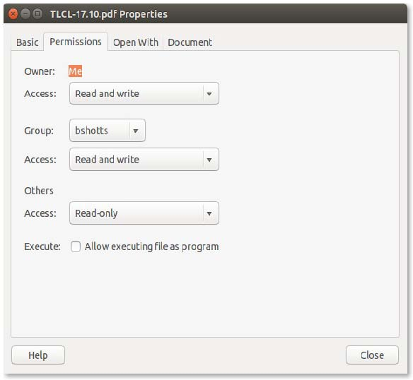

# 9. 许可

Unix 传统的操作系统区别于 MS-DOS 传统的，不仅仅在于<u>多任务</u>（*multitasking*），而且在于<u>多用户</u>（*multi-user*）。

这意味着什么呢？意味着在同一时间，允许多个用户使用计算机。典型的计算机只有一个键盘和监视器，不过仍允许多个用户使用。例如，如果一台计算机连接到一个网络或者互联网，远程用户可以通过 `ssh`（secure shell）登录并操作计算机。实际上，远程用户能执行图形应用，可以将图形输出显示到远程桌面。X 窗口系统作为其基本设计的一部分，支持该操作。

Linux 的多用户能力不是新近的「创新」，而是深深嵌入到操作系统的设计之中的一个特性。考虑创造 Unix 时的环境因素，这一点非常有意义。在计算机成为「个人」的多年之前，它们大而昂贵，而且是集中化的。一个典型的大学计算机系统，例如，由一个位于一个建筑内的大型中央计算机和遍布校园的连接到大型中央计算机的终端所组成。计算机会在同一时间支持多个用户。

要做到这一点，必须设计一个方案以各自保护用户。然后，一个用户的行为不会导致计算机崩溃，也不会干预属于其他用户的文件。

本章中，我们要看一下系统安全的基本内容，介绍下列命令：

- `id` 显示用户身份
- `chmod` 变更文件的模式
- `umask` 设置缺省情况下的文件许可
- `su` 以另一个用户运行 shell
- `sudo` 以另一个用户执行一个命令
- `chown` 变更文件属主
- `chgrp` 变更文件属组
- `passwd` 变更用户密码

## 属主、组成员、其他人

第 3 章中，当我们浏览系统，试着检查一个文件，如 `/etc/shadow` 时，我们可能就遇到一个问题。

```bash
[me@linuxbox ~]$ file /etc/shadow
/etc/shadow: regular file, no read permission
[me@linuxbox ~]$ less /etc/shadow
/etc/shadow: Permission denied
```

这个错误的原因是，作为一个普通用户，我们读取这个文件的许可。

在 Unix 安全模型中，一个用户可以<u>拥有</u>（*own*）文件和目录。当一个用户拥有一个文件或目录，该用户可以控制其访问权限。反之，用户们可以属于由一个或多个用户组成的<u>组</u>（*group*），由文件和目录的属主授权接入。在授权一个组接入的同时，属主也可以授予一些接入权限给所有人，在 Unix 术语中被称为<u>世界</u>（*world*）。要查阅关于你自己的身份信息，使用 `id` 命令。

```bash
[me@linuxbox ~]$ id
uid=500(me) gid=500(me) groups=500(me)
```

来看一下输出结果。当创建用户帐户时，会分配给用户一个被称为<u>用户 ID</u>（*user id* 即 *uid*）的数字，同时，为了人类可读的缘故，被映射到一个用户名。用户被分配一个<u>主组 ID</u>（*primary group id* 即 *gid*），也可以属于其它附加的组。上面的例子来自 Fedora 系统。其它系统上，如 Ubuntu，输出可能会有所不同：

```bash
[me@linuxbox ~]$ id
uid=1000(me) gid=1000(me)
groups=4(adm),20(dialout),24(cdrom),25(floppy),29(audio),30(dip),44(v
ideo),46(plugdev),108(lpadmin),114(admin),1000(me)
```

我们看到，uid 和 gid 的数字在两个系统中是不同的。一个简单的理由是，Fedora 的常规用户帐号数字从 500 开始，Ubuntu 则始于 1000。我们还看到 Ubuntu 用户属于更多的组。这与 Ubuntu 管理系统设备和服务权限的方式有关。

那么，这信息从哪儿来？和 Linux 大多数情况相仿，来自一堆文本文件。用户帐户在 `/etc/passwd` 文件中被定义，组帐户在 `/etc/group` 文件中被定义。当用户帐户和组别被创建时，这些文件随着保存用户密码的文件 `/etc/shadow` 同时被修改。对于每个用户帐户，`/etc/passwd` 文件定义其用户名（登录名）、uid、gid、帐户实名、家目录和登录所用的 shell。如果我们检查 `/etc/passwod` 和 `/etc/group` 文件的内容，可以注意到除了常规用户帐户，还有超级用户（uid 0）和其他各种系统用户。

下一章中，当我们学习进程的时候，我们会看到这些其他系统「用户」实际上相当忙碌。

很多类 Unix 系统将常规用户分配到一个诸如「users」的组别，而现代 Linux 则创建一个唯一的与用户同名的单用户组。这会使许可分配更容易。

## 读、写、执行

对文件和目录而言，接入权利定义为读、写、执行三者。如果我们看  `ls` 命令的输出，能得到一些线索，来看这是如何得以实现的：

```bash
[me@linuxbox ~]$ > foo.txt
[me@linuxbox ~]$ ls -l foo.txt
-rw-rw-r-- 1 me me 0 2016-03-06 14:52 foo.txt
```

前 10 个字符是文件属性。其中第 1 个字符是文件类型。表 9-1 描述了最常见的文件类型（还有一些不常用的类型）：

表 9-1 文件类型

| 属性 | 文件类型                                                     |
| ---- | ------------------------------------------------------------ |
| `-`  | 常规文件                                                     |
| `d`  | 目录                                                         |
| `l`  | 符号链接。注意符号链接的其他文件属性总是 `rwxrwxrwx` 这样虚设的值，真实的文件属性是那些符号链接所指向的文件。 |
| `c`  | 字符特殊文件。该类型指将数据处理为比特流的设备，如终端或 `/dev/null`。 |
| `b`  | 块特殊文件。该类型指将数据处理为块的设备，如硬盘或 DVD 驱动器。 |

余下九个文件属性字符，叫做<u>文件模式</u>（*file mode*），表示文件属主、属组、其他人对文件的读、写和执行权限。

| Owner | Group | World |
| :---: | :---: | :---: |
| `rwx` | `rwx` | `rwx` |

表 9-2 描述了 `r`、`w`、`x` 模式属性对文件和目录的影响。

表 9-2：许可属性

| 属性 | 文件                                                         | 目录                                                         |
| ---- | ------------------------------------------------------------ | ------------------------------------------------------------ |
| `r`  | 允许打开、读取一个文件。                                     | 如果同时设置了执行权限，则允许列出目录的内容。               |
| `w`  | 允许写入或截断一个文件。不过这个属性并不允许重命名或删除文件，重命名和删除文件的权限取决于所在目录的属性。 | 如果同时设置了执行权限，则允许在该目录中创建、删除、重命名文件。 |
| `x`  | 允许将一个文件作为程序被执行。用脚本语言写成的程序文件必须同时被设置为可读、可执行。 | 允许进入该目录。如 `cd` *directory*。                        |

表 9-3 提供了一些文件属性设置的案例：

表 9-3 许可属性示例

| 文件属性     | 意义                                                         |
| ------------ | ------------------------------------------------------------ |
| `-rwx------` | 一个常规文件，属主可读可写可执行，其他用户不能接入该文件。   |
| `-rw-------` | 一个常规文件，属主可读可写，其他用户不能接入该文件。         |
| `-rw-r--r--` | 一个常规文件，属主可读可写，组成员可读，其他用户可读。       |
| `-rwxr-xr-x` | 一个常规文件，属主可读可写可执行，其他用户可读可执行。       |
| `-rw-rw----` | 一个常规文件，属主所在组的成员可读可写，其他用户不能接入该文件。 |
| `lrwxrwxrwx` | 一个符号链接。所有符号链接的许可都是「假」的，真实的许可权限由符号链接所指向的文件决定。 |
| `drwxrwx---` | 一个目录。属主和组成员能进入该目录并创建、重命名、删除文件。 |
| `drwxr-x---` | 一个目录。属主能进入该目录并创建、重命名、删除文件。组成员能进入目录，单不能创建、删除或重命名文件。 |

### chmod - 改变文件模式

要改变文件或目录的模式（许可），用 `chmod` 命令。注意只有文件的属主或超级用户能改变文件或目录的模式。`chmod` 支持两种不同的方法来指定模式变更：八进制或符号表示法。我们首先学习八进制表示法。

> **到底什么是八进制？**
>
> 八进制，和它的表亲，十六进制是用来在计算机中表示数字的数字系统。我们人类，因为多数是天生十根手指，所以数数用的是十进制。计算机不然，天生只有一根手指，所以只能用二进制数数。它们的数字系统只有两个数字，0 和 1.所以在二进制，数数是这样的：
>
> 0, 1, 10, 11, 100, 101, 110, 111, 1000, 1001, 1010, 1011...
>
> 八进制，用零到七这几个数字来计数，像这样：
>
> 0, 1, 2, 3, 4, 5, 6, 7, 10, 11, 12, 13, 14, 15, 16, 17, 20, 21...
>
> 十六进制，用零到九加字母「A」到「F」来计数：
>
> 0, 1, 2, 3, 4, 5, 6, 7, 8, 9, A, B, C, D, E, F, 10, 11, 12, 13...
>
> 我们能理解二进制（因为计算机只有一根手指），那八进制和十六进制有什么好处呢？答案是为了方便人类。很多时候，计算机中的小部分数据被表述为<u>位模式</u>（*bit patterns*）。以 RGB 颜色为例。大多数计算机显示，每个像素由三个颜色成分组成：八位的红、八位的绿、八位的蓝。可爱的中蓝色，会有 24 位数字：
>
> 010000110110111111001101
>
> 你怎么会喜欢每天在读写这种数字吗？我想是不会的。这里有另外一个数字系统，会有所帮助。每个十六进制的数字表示四个二进制数字，八进制中，每个数字表示三个二进制数字。所以我们的 24 位中蓝色数字可以被浓缩为六位十六进制数字：
>
> 436FCD
>
> 由于十六进制的数字与二进制数字是对齐的，我们可以看到颜色中的红色部分是 43，绿色是 6F，蓝色是 CD。
>
> 当前，十六进制表示法（经常写成「hex」），比八进制更通用，但是我们马上就能看到，八进制表示三位二进制的能力会非常有用……

随八进制表示法，我们用八个数字设置所需权限的模式。因为每个八进制数字表示三个二进制数字，非常好地映射到存储文件模式的方案。表 9-4 显示了具体含义。

表 9-4：二进制和八进制的文件模式

| 八进制 | 二进制 | 文件模式 |
| ------ | ------ | -------- |
| `0`       |  `000`      | `---`         |
| `1`       |  `001`      | `--x`         |
| `2`       |  `010`      | `-w-`         |
| `3`       |  `011`      | `-wx`         |
| `4`       |  `100`      | `r--`         |
| `5`       |  `101`      | `r-x`         |
| `6`       |  `110`      | `rw-`         |
| `7`       |  `111`      | `rwx`         |

使用三位八进制数字，我们能为属主、组成员和全部人员设置文件模式。

```bash
[me@linuxbox ~]$ > foo.txt
[me@linuxbox ~]$ ls -l foo.txt
-rw-rw-r-- 1 me  me  0 2016-03-06 14:52 foo.txt
[me@linuxbox ~]$ chmod 600 foo.txt
[me@linuxbox ~]$ ls -l foo.txt
-rw------- 1 me  me  0 2016-03-06 14:52 foo.txt
```

传递参数「600」，我们可以设置属主的权限为可读可写并删除其他用户的所有权限。尽管看起来记住八进制到二进制的映射看起来很不方便，我们通常仅需要使用几个常用的：`7 (rwx)`、`6 (rw-)`、`5 (r-x)`、`4 (r--)`、和 `0 (---)`。

`chmod` 也支持用符号表示法来指定文件模式。符号表示法被分成三部分。

- 改变将影响谁
- 将执行哪种操作
- 将设置什么权限

要指定谁受影响，用 u、g、o、a 的字母组合。见表 9-5。

表 9-5：`chmod` 符号表示法

| 符号 | 意义                                    |
| ---- | --------------------------------------- |
| `u`  | 「user」的缩写，意指文件或目录的属主。  |
| `g`  | 属组。                                  |
| `o`  | 「others」的缩写，意指所有人。          |
| `a`  | 「all」的缩写，`u` `g` `o` 三者的组合。 |

如果没有指定字符，将假定为「all」。操作可以是 `+` 意为赋予权限，`-` 意为剥夺权限，`=` 意为仅应用指定权限且移除其他全部权限。

权限是由 `r` `w` `x` 字符来指定。表 9-6 提供了一些符号表示法的案例：

表 9-6：`chmod` 符号表示法示例

| 记号        | 意义                                                         |
| ----------- | ------------------------------------------------------------ |
| `u+x`       | 为文件属主增加执行权限。                                     |
| `u-x`       | 为文件属主移除执行权限。                                     |
| `+x`        | 为所有人增加执行权限，等同于 `a+x`。                         |
| `o-rx`      | 移除其他人的读写权限。                                       |
| `go=rw`     | 为属组和其他人设置读写权限，如果这些用户之前有执行权限的，将被移除该权限。 |
| `u+x,go=rx` | 为属主增加执行权限，设置属组和其他用户的权限为可读可写。多个指定项可以用逗号分隔。 |

有些人更喜欢用八进制表示法，而有些人则更倾向与符号表示法。符号表示法真地提供了允许我们设置单个属性而不涉及任何其他用户的便利途径。

看一下 `chmod` 的手册页，可以获得更多细节和选项列表。有个关于 `--recursive` 选项的警告：它对文件和目录都有效，所以它并不如我们所期望的那样有用，我们很少有想要把文件和目录的权限设置为相同的。

### 用图形界面设置文件模式

现在我们已经看到如何设置文件和目录的权限了，于是我们能更好的理解图形用户界面中的权限对话框。在 Files（GNOME）和 Dolphin（KDE）中，右键单击一个文件或目录，将展开一个属性对话框。例如在 GNOME 中：



这里能看到属主、属组、其他用户的设置。

### umask - 设置默认许可

当一个文件刚被创建的时候，`umask` 命令控制其默认许可。它使用八进制表示法表示从文件模式属性中被移除的位的<u>掩码</u>（*mask*）。来看一下：

```bash
[me@linuxbox ~]$ rm -f foo.txt
[me@linuxbox ~]$ umask
0002
[me@linuxbox ~]$ > foo.txt
[me@linuxbox ~]$ ls -l foo.txt
-rw-rw-r-- 1  me  me  0 2018-03-06 14:53 foo.txt
```

首先，我们移除旧的 `foo.txt` 文件副本，确保我们重新开始。其次，我们运行 `umask` 命令，不带参数，来看一下当前的值。它反馈的值是 `0002`（另一个常见的默认值是 `0022`），就是八进制表示的掩码。然后我们创建一个新的 `foo.txt` 文件实例，来观察其权限许可。

我们可以看到属主和属组得到的是读写许可，其他用户则仅有只读权限。其他用户没有写权限，是由于掩码的值。我们重复一下，这次先设置一下掩码。

```bash
[me@linuxbox ~]$ rm foo.txt
[me@linuxbox ~]$ umask 0000
[me@linuxbox ~]$ > foo.txt
[me@linuxbox ~]$ ls -l foo.txt
-rw-rw-rw- 1  me  me  0 2018-03-06 14:58 foo.txt
```

当我们设置了 `0000` 的掩码（等效于关闭），我们现在看到其他用户的权限是可写的。要理解这是如何工作的，我们必须再次查看一下八进制。如果我们把掩码扩展到二进制，然后比较一下属性，就可以看到发生了什么了。

| 类型 | 值 |
| ------------ | ----------------- |
| 原始文件模式   | `--- rw- rw- rw-` |
| 掩码         | `000 000 000 010` |
| 结果         | `--- rw- rw- r--` |

忽略这里的前置零（稍后再说），观察 `1` 出现在掩码中，则该属性被移除——在这里，是其他用户的写权限。那就是掩码的作用。掩码中的 `1` 出现在哪里，哪个位置的权限就被取消。如果我们看值为 `0022` 的掩码，可以看到它干了什么。

| 类型         | 值                |
| ------------ | ----------------- |
| 原始文件模式 | `--- rw- rw- rw-` |
| 掩码         | `000 000 010 010` |
| 结果         | `--- rw- r-- r--` |

又一次，当 `1` 出现在二进制值中，相应的属性被取消。试着用其它值（试试其它七个）来习惯它的工作方法。试验完成后，记得清理一下：

```bash
[me@linuxbox ~]$ rm foo.txt; umask 0002
```

大多数时候我们不必变更掩码，发行版提供的默认值就可以了。在一些有高度安全要求的情况下，我们会想要控制一下。

> **一些特殊许可**
>
> 尽管我们常常看到三位数字的八进制许可掩码，不过从技术上讲，改成四位数字更正确。为何？因为除了读写执行权限之外，有一些其它很少用到的权限设置。
>
> 第一个是<u>设置用户 ID 位</u>（*setuid bit*），八进制 `4000`。应用于可执行文件时，它会将实际用户（实际运行程序的用户）的<u>有效用户 ID</u>（*effective user ID*）设置为程序所有者的有效用户 ID。多数情况下，会给到超级用户拥有的一些程序。当一个普通用户运行一个「*setuid root*」的程序时，程序以超级用户的有效优先权运行。这将允许程序访问那些普通用户通常情况下被禁止访问的文件和目录。因为这会引起安全问题，所以设置用户 ID 的程序必须控制在绝对少量。
>
> 第二个很少用到的<u>设置组 ID 位</u>（*setgid bit*），八进制 `2000`，类似设置用户 ID 位，它会将<u>实际组</u>（*real group ID*）的<u>有效组 ID</u>（*effective group ID*）设置为程序所有者的有效组 ID。如果设置组 ID 位设置在一个目录，在该目录中新建的文件将被给予属组，而非文件创建者所属的组。这在共享目录中会很有用，当多个组的成员需要访问目录中的文件，不必理会文件属主最初属于什么组。
>
> 第三个被称为粘性位（*sticky bit*），八进制 `1000`。这延续自古老的 Unix，可以将可执行文件标记为「不可交换」。对文件而言，Linux 忽略粘性位，不过可以应用到目录，以预防非目录或文件的属主或超级用户删除或重命名文件。经常用于控制访问一个如 `/tmp` 的共享目录。
>
> 下面是一些 `chmod` 符号表示法的使用示例。分配设置用户 ID 给一个程序：
>
> `chmod u+s program`
>
> 下面是分配设置组 ID 到目录：
>
> `chmod g+s dir`
>
> 最后看一个分配粘性位到目录：
>
> `chmod +t dir`
>
> 当查看 `ls` 输出时，你可以判断特殊权限。下面是一些示例。首先，一个设置用户 ID 的程序：
>
> `-rwsr-xr-x`
>
> 设置组 ID 的目录：
>
> `drwxrwsw-x`
>
> 设置过粘性位的目录：
>
> `drwxrwxrwt`

## 变更身份

在不同的时间，我们会发现有必要使用其他用户的身份。我们经常需要获得超级用户权限来完成管理任务，也有可能要「成为」另一个普通用户来做一些测试。有三种途径来转换身份。

1. 注销并以另一用户重新登录
2. 使用 `su` 命令
3. 使用 `sudo` 命令

我们忽略第一种技术，因为我们知道如何做，而且比较其它两种方法，它不够方便。在我们的 shell 会话过程中，`su` 命令允许我们假设另一个用户的身份，并以其身份开启一个新的 shell 会话，或者以该用户提交一个简单的命令。`sudo` 命令允许允许管理员建立一个 `/etc/sudoers` 的配置文件，定义指定命令，允许特别用户以假定身份执行。选择使用哪个命令，取决于你所用的是什么 Linux 发行版。或许你的发行版包含了这两个命令，但它的配置将选择性偏向于其中的一个。我们从 `su` 开始。

### su - 用替代用户和组身份运行 shell

`su` 命令用来以另一个用户开启 shell。命令句法如下：

```bash
su [-[l]] [user]
```

如果包含了 `-l` 选项，	生成的 shell 会话是指定用户的登录 shell。这意味着装载了用户的系统环境，且工作目录切换到用户的家目录。这通常是我们想要的。如果用户没有被指定，则假定为超级用户。注意，很奇怪地，通常情况下，`-l` 可以简写成 `-`。要开启一个超级用户的 shell，我们这么做：

```bash
[me@linuxbox ~]$ su -
Password:
[root@linuxbox ~]#
```

在键入命令之后，提示我们输入超级用户的密码。如果输入密码成功，新的 shell 提示符指示这个 shell 具有超级用户权限（尾随的是 `#` 而非 `$`），当前工作目录也已经切换到超级用户的家目录（通常是 `/root`）。一旦在新的 shell 中，我们能以超级用户身份来完成命令。当结束时，键入 `exit` 回到先前的 shell。

```bash
[root@linuxbox ~]# exit
[me@linuxbox ~]$
```

也可以执行一条单行命令，而非开启一个新的交互命令，如下：

```bash
su -c 'command'
```

用这种形式，执行一个单行命令，以取代一个新的 shell。将命令包含在单引号中，是很重要的，因为我们不想在当前的 shell 中发生什么扩展，而是在新的 shell 中发生扩展。

```bash
[me@linuxbox ~]$ su -c 'ls -l /root/*'
Password:
-rw------- 1 root root 754 2007-08-11 03:19 /root/anaconda-ks.cfg

/root/Mail:
total 0
[me@linuxbox ~]$
```

### sudo - 以另一个用户的身份执行命令

`sudo` 命令在很多方面类似 `su`，不过也有一些重要的附加功能。管理员可以配置 `sudo` 以允许一个普通用户用另一个用户（通常是超级用户）的身份执行命令。特别是，一个用户受限于一个或多个指定的命令而不限于其它命令。另一个重要的差异是，用 `sudo` 不需要超级用户的密码。要授权使用 `sudo`，需要的是用户自己的密码。例如，`sudo` 已经配置为允许我们运行一个虚拟的备份程序「backup_script」，需要超级用户权限。使用 `sudo` 则如下：

```bash
[me@linuxbox ~]$ sudo backup_script
Password:
System Backup Starting...
```

键入命令之后，提示我们输入自己的密码（不是超级用户的），一旦授权成功，指定命令将被完成。`su` 和 `sudo` 的一个重要的差别是，`sudo` 不会开启一个新的 shell，也不会加载另一个用户的系统环境。这意味着命令不需要被引号包括，和不用 `sudo` 是一样的。注意可以通过指定各种选项来覆盖此行为。还有，`sudo` 可以用 `-i` 选项来开启一个超级用户的交互会话（有点像 `su -`）。具体可以查看 `sudo` 的手册页。

要查看 `sudo` 授予了哪些特权，用 `-l` 选项列出：

```bash
[me@linuxbox ~]$ sudo -l
User me may run the following commands on this host:
    (ALL) ALL
```

> **Ubuntu 和 sudo**
>
> 普通用户重复遇到的一个问题就是，如何执行需要超级用户权限的任务。这些任务包括安装升级软件，编辑系统配置文件，访问设备等。在 Windows 世界中，只要给予用户管理员权限就可以允许用户执行任务了。但是，它还使用户执行的程序具有相同的能力。大多数情况，这是可取的，但是，它还允许病毒等<u>恶意软件</u>（*malware*: malicious software）自由控制计算机。
>
> 在 Unix 世界，普通用户和管理员之间一直有更大的区别，这归因于 Unix 的多用户传统。Unix 中采用的方法是仅在需要时授予超级用户权限。通常用 `su` 和 `sudo` 来做到这一点。
>
> 早些年之前，大多数 Linux 发行版依赖于 `su` 来实现这功能。`su` 不需要 `sudo` 所需的配置，Unix 传统中就有个 root 帐户。这引入了一个问题。用户在不必要的情况下，也会尝试用 root 身份操作。事实上，

### chown - 变更文件的属主和组


### chgrp - 变更组的属主


## 优先权练习


## 变更密码


## 总结


## 扩展阅读

