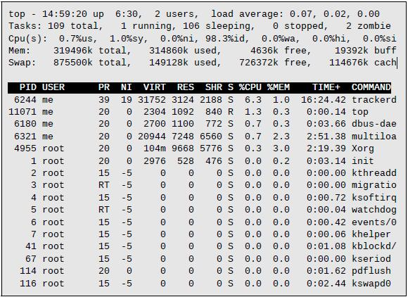

# 10. 进程

现代操作系统通常是<u>多任务</u>（*multitasking*）的，意味着它们通过迅速地从一个正在执行的程序切换到另一个程序，来创造一种计算机在同一时间内能做多个事务的错觉。Linux 内核用<u>进程</u>（*processes*）管理多任务。进程是 Linux 如何组织各个不同程序以等待 CPU 处理它们的程序。

有时，计算机会变得很迟钝，或者一个应用程序会停止响应。在本章中，我们将看到命令行中一些可用的工具，让我们检查程序正在做什么，并终结那些错误行为的进程。

本章将介绍下列命令：

- `ps` 报告当前所有进程的快照
- `top` 显示任务
- `jobs` 列出活动的工作
- `bg` 将一个工作置于后台
- `fg` 将一个工作置于前台
- `kill` 发送信号给进程
- `killall` 通过名称杀掉进程
- `shutdown` 关闭或重启系统

## 一个进程如何工作

当系统启动，内核发起一些自己的活动作为进程，并启动一个名为 `init` 的程序。`init` 反过来运行一系列被称为初始脚本（*init scripts*）的 shell 脚本（位于 `/etc`）以启动所有的系统服务。许多服务被当作<u>守护程序</u>（*daemon programs*）来执行，即程序仅仅在后台呆着，做着自己的工作，没有任何用户界面。所以，即使我们没有登录，系统已经在忙于开展一些例行事务了。

一个程序能运行其它程序，在进程方案中被表述为一个<u>父进程</u>（*parent process*）制造了一个<u>子进程</u>（*child process*）。

内核维护着关于每个进程的信息，以帮助保持良好的组织性。例如，每个进程被分配到一个称为<u>进程 ID</u>（*process ID* 即 *PID*）的数字。PID 按升序分配，`init` 进程总是得到 1 号 PID。内核还会跟踪分配给每个进程的内存，以及进程恢复执行的准备情况。和文件一样，进程也拥有属主和用户 ID、有效用户 ID 等。

## 查看进程

查看进程的几个命令中，最常用的一个是 `ps`。`ps` 程序有很多选项，但是最近单的使用形式是这样的：

```bash
[me@linuxbox ~]$ ps
  PID    TTY          TIME    CMD
 5198    pts/1    00:00:00    bash
10129    pts/1    00:00:00    ps
```

上例结果中列出了两个进程，分别是 `5198` 号的 `bash` 和 `10129` 号的 `ps`。我们可以看到，默认情况下 `ps` 不会显示给我们很多，而仅仅显示与当前终端会话关联的进程。要查看更多进程，我们需要加一些选项，不过首先让我们看一下 `ps` 输出的其它各个字段。`TTY` 是「teletype」的简写，指进程的<u>控制终端</u>（*controlling terminal*）。Unix 在这里显示该进程的寿命。`TIME` 字段是该进程消耗 CPU 的时长。如我们所见，没有进程让计算机工作得很辛苦。

如果我们加个选项，我们就能得到一张系统正在干嘛的更大的图片。

```bash
[me@linuxbox ~]$ ps x
  PID TTY STAT TIME  COMMAND
 2799 ?   Ssl  0:00  /usr/libexec/bonobo-activation-server –ac
 2820 ?   Sl   0:01  /usr/libexec/evolution-data-server-1.10 --
15647 ?   Ss   0:00  /bin/sh /usr/bin/startkde
15751 ?   Ss   0:00  /usr/bin/ssh-agent /usr/bin/dbus-launch --
15754 ?   S    0:00  /usr/bin/dbus-launch --exit-with-session
15755 ?   Ss   0:01  /bin/dbus-daemon --fork --print-pid 4 –pr
15774 ?   Ss   0:02  /usr/bin/gpg-agent -s –daemon
15793 ?   S    0:00  start_kdeinit --new-startup +kcminit_start
15794 ?   Ss   0:00  kdeinit Running...
15797 ?   S    0:00  dcopserver –nosid
and many more...
```

加了「x」选项（注意，没有前置的连字符）告诉 `ps` 显示所有进程，不论这些进程由哪个终端控制。`TTY` 字段的 `?` 指示没有控制终端。使用这个选项，我们看到了属于自己的全部进程。

由于系统正在运行许多进程，`ps` 也产生了一个很长的清单。所以用将 `ps` 的输出管道输入到 `less` 会更便于查看。一些选项合并也会产生很多行的输出，所以最大化终端模拟器窗口，也是个好主意吧。

有个新字段 `STAT` 出现在输出中。`STAT` 是「state」的简写，揭示进程的当前状态，如表 10-1 所示。

表 10-1：进程状态

| 状态 | 意义 |
| ---- | ---- |
| `R`     | 运行中。意为进程正在运行或准备运行。 |
| `S`     | 睡眠中。进程没有在运行；在等待一个事件，如一次击键，或一个网络包。 |
| `D`     | 不间断睡眠。进程正在等待输入输出，如磁盘驱动器。 |
| `T`     | 停止中。该程序已被指示停止。本章稍后详述。 |
| `Z`     | 已失效或「僵尸」进程。已经终止到没有被其父进程清理的子进程。 |
| `<`     | 高优先级进程。可能是授予一个进程更高的重要性，给予其更多的 CPU 时间。这个进程的属性被称为<u>nice 值</u>（*niceness*）。一个高优先级的进程被唤作具有低 nice 值，因为它拿走了更多的 CPU 时间，留给其它进程的就更少了。 |
| `N`     | 低优先级进程。具有低优先级的进程（一个「好」进程）仅在其它高优先级进程得到服务之后才得到处理器时间。 |

进程状态可能还会跟随其它字符。这指示进程具有特殊的性质。

另一个广泛使用的选项组合是 `aux`（没有前置连字符）。这给予我们更多信息。

```bash
[me@linuxbox ~]$ ps aux
USER PID %CPU %MEM  VSZ RSS TTY STAT START TIME COMMAND
root   1  0.0  0.0 2136 644 ?   Ss   Mar05 0:31 init
root   2  0.0  0.0    0   0 ?   S<   Mar05 0:00 [kt]
root   3  0.0  0.0    0   0 ?   S<   Mar05 0:00 [mi]
root   4  0.0  0.0    0   0 ?   S<   Mar05 0:00 [ks]
root   5  0.0  0.0    0   0 ?   S<   Mar05 0:06 [wa]
root   6  0.0  0.0    0   0 ?   S<   Mar05 0:36 [ev]
root   7  0.0  0.0    0   0 ?   S<   Mar05 0:00 [kh]
and many more...
```

这个选项组合显示了所有用户的进程。使用不带前导短划线的选项会调用具有「BSD 样式」行为的命令。Linux 版本的 `ps` 可以模拟多个不同的 Unix 实现中的 `ps` 程序。使用这些选项，我们能获得额外的字段，如表 10-2 所示。

表 10-2：BSD 风格的 `ps` 行首

| 头部    | 意义                                                        |
| ------- | ----------------------------------------------------------- |
| `USER`  | 用户 ID。该进程的属主。                                     |
| `%CPU`  | CPU 使用率的百分比。                                        |
| `%MEM`  | 内存使用率的百分比。                                        |
| `VSZ`   | 虚拟内存大小。                                              |
| `RSS`   | 驻留集大小。此为该进程物理内存（RAM）的用量，用 KB 为单位。 |
| `START` | 进程开始的时间。若超过 24 小时，则使用日期表示。            |

### 用 top 动态查看进程

`ps` 命令可以查看机器在做什么，它仅仅提供机器在执行 `ps` 命令的那一刻状态的快照。要查看机器的动态活动，就需要使用 `top` 命令：

```bash
[me@linuxbox ~]$ top
```

`top` 程序显示持续更新（默认每三秒刷新一次）的系统进程列表，以进程活跃程度排序。这个程序的得名 `top`，就因为该程序常用来查看系统中置顶的进程。`top` 显示分为两部分：首先显示的是系统摘要信息，紧跟着以 CPU 活动为序列出进程详单。



系统摘要包含了一大堆好东西。这里会给出解释：

表 10-3：top 信息字段

| 行   | 字段         | 意义                                                         |
| ---- | ------------ | ------------------------------------------------------------ |
| 1    | `top`          | 程序名称。                                                   |
|      | `14:59:20`     | 当前时间。                                                   |
|      | `up 6:30`      | <u>运行时间</u>（*uptime*）。指距离上一次启动机器的时长。在这个例子中，系统已经运行了六小时三十分钟。 |
|      | `2 users`      | 当前有两个用户登录着。                                       |
|      | `load average` |                                                              |
|      |              |                                                              |
|      |              |                                                              |
|      |              |                                                              |
|      |              |                                                              |
|      |              |                                                              |
|      |              |                                                              |
|      |              |                                                              |
|      |              |                                                              |
|      |              |                                                              |


## 控制进程


### 中断一个进程


### 将一个进程置于后台


### 将一个进程带回前台


### 终止（暂停）一个进程


## 信号


### 用 kill 发送信号给进程


### 用 killall 发送信号给多个进程


## 关闭系统


## 更多进程相关的命令


## 总结

