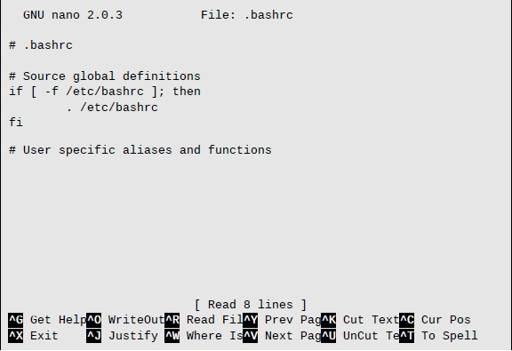

# 11. 环境

如早先讨论过的，在会话中，shell 维护着一个信息主体，称为<u>环境</u>（*environment*）。程序使用存储在环境中的数据来确定关于系统配置的实际情况。大部分程序使用<u>配置文件</u>（*configuration files*）存储程序设置，还有部分程序也会查找存储在环境中的值来调整其行为。了解到这一点，我们能用环境来自定义我们的 shell 体验。

本章中我们将和下列命令一起工作：

- `printenv` 打印部分或全部环境
- `set` 设置 shell 选项
- `export` 输出环境到后续执行程序
- `alias` 为一个命令创建一个别名

## 存储在环境中的是什么？

有两种基本类型的数据存储在 shell 中；不过，在 `bash` 中这两种类型在很大程度上难以区分。即<u>环境变量</u>（*environment variables*）和 <u>shell 变量</u>（*shell variables*）。Shell 变量是由 `bash` 安置的数据，环境变量则是其它所有数据。变量之外，shell 还存储一些程序数据，名为<u>别名</u>（*aliases*）和 <u>shell 函数</u>（*shell functions*）。在第 5 章「用命令工作」中我们学过别名，我们将在第四部分中学习 shell 函数（与 shell 脚本关联）。

### 检查环境

要查看环境中存储的是什么，我们可以使用 `bash` 内建的 `set` 或者 `printenv` 程序。`set` 命令会显示 shell 和环境变量两者，而 `printenv` 仅仅显示后者。由于环境列表的内容相当长，最好使用管道将命令的输出转入 `less`。

```bash
[me@linuxbox ~]$ printenv | less
```

如此，我们将得到这样的结果：

```bash
USER=me
PAGER=less
LSCOLORS=Gxfxcxdxbxegedabagacad
XDG_CONFIG_DIRS=/etc/xdg/xdg-ubuntu:/usr/share/upstart/xdg:/etc/xdg
PATH=/home/me/bin:/usr/local/sbin:/usr/local/bin:/usr/sbin:/usr/bin:/
sbin:/bin:/usr/games:/usr/local/games
DESKTOP_SESSION=ubuntu
QT_IM_MODULE=ibus
QT_QPA_PLATFORMTHEME=appmenu-qt5
JOB=dbus
PWD=/home/me
XMODIFIERS=@im=ibus
GNOME_KEYRING_PID=1850
LANG=en_US.UTF-8
GDM_LANG=en_US
MANDATORY_PATH=/usr/share/gconf/ubuntu.mandatory.path
 MASTER_HOST=linuxbox
IM_CONFIG_PHASE=1
COMPIZ_CONFIG_PROFILE=ubuntu
GDMSESSION=ubuntu
SESSIONTYPE=gnome-session
XDG_SEAT=seat0
HOME=/home/me
SHLVL=2
LANGUAGE=en_US
GNOME_DESKTOP_SESSION_ID=this-is-deprecated
LESS=-R
LOGNAME=me
COMPIZ_BIN_PATH=/usr/bin/
LC_CTYPE=en_US.UTF-8
XDG_DATA_DIRS=/usr/share/ubuntu:/usr/share/gnome:/usr/local/share/:/
usr/share/
QT4_IM_MODULE=xim
DBUS_SESSION_BUS_ADDRESS=unix:abstract=/tmp/dbus-IwaesmWaT0
LESSOPEN=| /usr/bin/lesspipe %s
INSTANCE=
```

我们看到的，是环境变量及其值。例如，我们看到一个变量 `USER`，其所包含的值是 `me`。`printenv` 命令还能列出指定变量的值。

```bash
[me@linuxbox ~]$ printenv USER
me
```

`set` 命令，在没有添加选项或参数的情况下，将显示 shell 变量和环境变量两者，还有任何定义过的 shell 函数。和 `printenv` 不同，其输出按字母表顺序友好地排列。

```bash
[me@linuxbox ~]$ set | less
```

也可以用 `echo` 命令查看变量内容，如：

````bash
[me@linuxbox ~]$ echo $HOME
/home/me
````

环境中有一个元素，在 `set` 和 `printenv` 中都没有被显示，它就是别名。要查看别名，键入 `alias` 命令，不用带参数。

```bash
[me@linuxbox ~]$ alias
alias l.='ls -d .* --color=tty'
alias ll='ls -l --color=tty'
alias ls='ls --color=tty'
alias vi='vim'
alias which='alias | /usr/bin/which --tty-only --read-alias --show-dot --show-tilde'
```

### 一些有趣的变量

环境包含很多变量，虽然环境与此处提供的环境不同，我们还是会在我们的环境中看到表 11-1 中列出的变量。

表 11-1 环境变量

| 变量      | 内容                                                         |
| --------- | ------------------------------------------------------------ |
| `DISPLAY` | 如果我们正在运行图形环境，这里就是显示的名称。通常其值为「:0」，意为 X server 生成的第一个显示。 |
| `EDITOR`  | 用来编辑文本的程序的名称。                                   |
| `SHELL`   | 用户默认的 shell 程序的名称。                                |
| `HOME`    | 用户家目录的路径名称。                                       |
| `LANG`    | 定义用户语言的字符集和排序规则。                             |
| `OLDPWD`  | 前一个工作目录。                                             |
| `PAGER`   | 用来分页输出的程序名称。这里通常被设置为 `/usr/bin/less`。   |
| `PATH`    | 一个用分号分隔的目录列表，用来检索我们输入的可执行程序名称。 |
| `PS1`     | 代表「prompt string 1」。定义 shell 提示符的内容。我们等会儿会看到，这可以广泛的自定义。 |
| `PWD`     | 当前工作目录。                                               |
| `TERM`    | 终端类型的名称。类 Unix 系统支持很多终端协议；该变量定义终端模拟器中被用到的协议。 |
| `TZ`      | 指定你的时区。多数类 Unix 系统按 <u>UTC 时间</u>（协调世界时 *Coordinated Universal Time*）来维护计算机内部时钟，通过此变量中设置的偏移量来显示当地时间。 |
| `USER`    | 你的用户名。                                                 |

不要担心这些变量的值会丢失。它们随发行版而变化。

## 环境如何被建立？

当我们登录系统，`bash` 程序启动，读取一系列名为<u>启动文件</u>（*startup files*）的配置脚本，这些文件定义了所有用户的默认环境。紧跟着的更多的，是来自我们的家目录中定义我们个人环境的启动文件。实际的顺序取决于正在启动的 shell 会话的类型。有两种类型。

- **登录 shell 会话**，指我们被提示输入用户名和密码的会话，例如，会发生在我们启动一个虚拟控制台会话中。
- **非登录 shell 会话**，典型地发生在图形界面中启动一个终端会话。

登录 shell 会话将读取如表 11-2 中所列的启动文件。

表 11-2：登录 shell 会话的启动文件

| 文件              | 内容                                                         |
| ----------------- | ------------------------------------------------------------ |
| `/etc/profile`    | 应用到所有用户的全局配置脚本。                               |
| `~/.bash_profile` | 一个用户个人启动文件。用来扩展或覆盖全局配置脚本。           |
| `~/.bash_login`   | 如果找不到上一个文件，`bash` 将尝试读取这个脚本。            |
| `~/.profile`      | 如果找不到上两个文件，`bash` 将尝试读取该文件。在 Debian 系的发行版（如 Ubuntu）中，这个文件是默认的。 |

非登录 shell 会话将读取如表 11-3 中所列的启动文件。

表 11-3：非登录 shell 会话的启动文件

| 文件               | 内容                                               |
| ------------------ | -------------------------------------------------- |
| `/etc/bash.bashrc` | 应用到所有用户的全局配置脚本。                     |
| `~/.bashrc`        | 一个用户个人启动文件。用来扩展或覆盖全局配置脚本。 |

在读取表 11-3 的启动文件之外，非登录 shell 还将从它们的父进程中继承环境，通常是一个登录 shell。

来看一下哪些启动文件被安装了。记住，由于上述文件的文件名多数由一个句点开头（意味着它们是隐藏文件），我们将要在 `ls` 命令中使用 `-a` 选项。

对于普通用户来说，`~/.bashrc` 文件可能是最重要的启动文件了，因为它总是被读取。非登录 shell 默认读取该文件，多数登录 shell 的启动文件也会以读取 `~/.bashrc` 文件来编写。

### 启动文件中有什么？

如果我们看一下一个典型的 `.bash_profile` （取自 CentOS 6 系统）文件，看起来像这样：

```bash
# .bash_profile

# Get the aliases and functions
if [ -f ~/.bashrc ]; then
        . ~/.bashrc
fi

# User specific environment and startup programs

PATH=$PATH:$HOME/bin
export PATH
```

以 `#` 开头的行，是<u>注释</u>（*comments*），不会被 shell 读取，是为了让人类读取的。第一个有趣的事发生在第四行：

```bash
if [ -f ~/.bashrc ]; then
        . ~/.bashrc
fi
```

这叫 <u>if 组合命令</u>（*if compound command*），我们将在第四部分完整地学习，现在则简单翻译如下：

```bash
If the file "~/.bashrc" exists, then
    read the "~/.bashrc" file.
```

我们可以看到这些代码如何让一个登录 shell 获取 `.bahsrc` 文件的内容的。启动文件要做的下一件事，是 `PATH` 变量。

当我们在命令行中键入命令的时候，是不是总在好奇 shell 是如何知道去哪里找命令的？例如，当我们键入 `ls`，shell 不会检索整个计算机去找 `/bin/ls`（`ls` 命令的完整路径名）；相反，它会检索包含在 `PATH` 变量中的目录列表。

`PATH` 变量经常（而非总是，依赖于2发行版）由 `/etc/profile` 启动文件中的这些代码所设置：

```bash
PATH=$PATH:$HOME/bin
```

`PATH` 被修改为将目录 `$HOME/bin` 附加到列表末尾。这是一个参数扩展的例子，我们在第七章「如 Shell 般看世界」中接触过。尝试下列命令来演示其如何工作：

```bash
[me@linuxbox ~]$ foo="This is some "
[me@linuxbox ~]$ echo $foo
This is some
[me@linuxbox ~]$ foo=$foo"text."
[me@linuxbox ~]$ echo $foo
This is some text.
```

通过这个技术，我们能将文本附加到变量的内容中。

将字符串 `$HOME/bin` 加到 `PATH` 变量的内容中，目录 `$HOME/bin` 也就被加到键入命令时要检索的目录列表中。意味着当我们在自己的家目录中创建一个目录来存放私人的程序时，shell 已经准备好容纳我们。我们需要做的是把这个目录命名为 `bin`，我们已经准备好了。

> **注意：**许多发行版默认提供这个 `PATH` 设置。Debian 系发行版，如 Ubuntu，在登录是会测试 `~/bin` 的存在，并在找到后动态地加其添加到 `PATH` 变量中。

最后我们会：

```bash
export PATH
```

`export` 命令会告诉 shell 使得 `PATH` 变量的内容在此 shell 中生效。

## 修改环境

由于我们知道启动文件在哪里，知道它们包含了什么，所以我们可以修改这些文件来自定义我们的环境。

### 我们该修改什么文件？

作为一个普通规则，将目录加到 `PATH` 变量或者定义额外的环境变量，将这些变更放到 `.bash_profile` 文件（或者等效的，取决于发行版，如 Ubuntu 会使用 `.profile`）。其它任何东西的变更将会放在 `.bashrc` 中。

> **注意：**除非你是系统管理员，需要变更系统中所有用户的默认设置，否则请将你的修改限制在自己家目录的文件中。当然会有可能修改 `/etc` 目录中的 `profile` 文件，并且在很多情况下，这样做是明智的，但是就目前而言，让我们安全一点。

### 文本编辑器

要编辑（修改）shell 的启动文件，还有系统中的其它配置文件，需要用到一个称为<u>文本编辑器</u>（*text editor*）的程序。文本编辑器是一个程序，在某些方面来说，类似一个文字处理，如允许我们用移动的光标来编辑屏幕上的文字。其不同于文字处理的地方在于，仅能支持纯文本并通常包含为编写程序而设计的特性。文本编辑器是软件开发者用来编写代码，和系统管理员管理配置文件以控制系统的中心工具。

在 Linux 系统中有很多文本编辑器，许多系统都安装了好几个。为何会有这么多不同的呢？因为程序员广泛地使用它们，所以程序员喜欢写文本编辑器，他们编写编辑器来表达它们自己的需要，他们该如何工作。

文本编辑器有两种基本类别：图形化的、和基于文本的。GNOME 和 KDE 各自包含了一些受欢迎的图形编辑器。GNOME 随带一个称为 `gedit` 的编辑器，通常在 GNOME 菜单中被唤作「Text Editor」。KDE 携带有 `kedit`、`kwrite`、`kate` 三个。

有很多基于文本的编辑器，广受欢迎的是 `nano`、`vi`，还有 `emacs`。`nano` 简单，便于使用，作为 `PINE` 电子邮件套装提供的 `pico` 编辑器的替代品来设计。`vi`（在大多数 Linux 系统中，被名为「vi improved」的 `vim` 的程序所替代）是类 Unix 系统中传统的编辑器。它将会是下一章中的主题。`emacs` 编辑器最初由 Richard Stallman 编写。它是一个庞然大物，全功能的，无事不做的编程环境。它一应俱全，却很少被大多数 Linux 系统默认安装。

### 使用文本编辑器

文本编辑器能在命令行被调用，可以在编辑器名称之后输入我们想要编辑的文件名。如果文件不存在，编辑器将假定我们想要创建一个新文件。这里是用 `gedit` 的一个示例：

```bash
[me@linuxbox ~]$ gedit some_file
```

该命令将启动 `gedit` 文本编辑器并加载名为「some_file」的文件，如果该文件存在的话。

图形文本编辑器相当简单易用，我们不打算在这里讲述。我们将集中在第一个基于文本的文本编辑器，`nano`。让我们启动 `nano` 编辑 `.bashrc` 文件。不过事先，来练习一些「安全计算」。无论何时，当我们编辑一个重要的配置文件，首先创建一个备份是个好主意。如果在编辑时弄乱了文件，这会是一个保护。要创建 `.bashrc` 文件的备份，这么做：

```bash
[me@linuxbox ~]$ cp .bashrc .bashrc.bak
```

我们如何命名备份文件并不重要，只需要选一个能理解的名字就好。扩展名 `.bak`、`.sav`、`.old`、`.orig` 都是指示一个备份文件的流行的方式。哦，记住 `cp` 会静默地<u>覆盖现存文件</u>（*overwrite existing files*）。

既然我们有了一个备份文件，就可以开始编辑了。

```bash
[me@linuxbox ~]$ nano .bashrc
```

当 `nano` 启动，我们看到屏幕上显示这样：



> **注意：**如果你的系统中没有安装 `nano`，可以使用图形编辑器作为替代。

屏幕由三部分组成，顶端的头部、中部是被编辑的文件的文本，下方是命令菜单。由于 `nano` 被设计来替换一个由 email 客户端所提供的文本编辑器，所以编辑功能不强。

在学习任一文本编辑器时，我们所要学的第一条命令是如何退出编辑器。在 `nano`，我们可以按 `Ctrl-x` 来退出。在屏幕末端的菜单中有指示。记号 `^X` 意味着 `Ctrl-x`。在很多程序中这是一个控制键的常用记号。

我们需要学习的第二个命令是如何保存工作。在 `nano` 中是 `Ctrl-o`。具备这些知识，我们可以准备编辑了。使用向下箭头键或 `PageDown` 键，将光标移动到文件末尾，在 `.bashrc` 文件中加入下列几行：

```bash
umask 0002
export HISTCONTROL=ignoredups
export HISTSIZE=1000
alias l.='ls -d .* --color=auto'
alias ll='ls -l --color=auto'
```

> **注意：**你所用的发行版可能已经包含了一些上述命令，不过重复不会导致任何损害。

表 11-4 中详述我们添加的内容的意义。

表 11-4：我们添加到 `.bashrc` 的内容

| 行                                 | 意义                                                         |
| ---------------------------------- | ------------------------------------------------------------ |
| `umask 0002`                       | 设置 `umask` 以解决共享目录问题，在第九章「许可」中我们已经讨论过。 |
| `export HISTCONTROL=ignoredups`    | 设置 shell 的历史记录忽略重复上一条命令的命令。              |
| `export HISTSIZE=1000`             | 将命令历史的条目数从默认的 500 行增加到 1000 行。            |
| `alias l.='ls -d .* --color=auto'` | 创建一个名为 `l.` 的新命令，显示以 `.` 开头的目录。          |
| `alias ll='ls -l --color=auto'`    | 创建一个名为 `ll` 的新命令，以长格式显示目录列表。           |

如我们所见，我们所添加的很多都不够直观明了，所以在 `.bashrc` 文件中添加一些注释以帮助理解，是个好主意。使用编辑器，变更内容如下：

```bash
# Change umask to make directory sharing easier
umask 0002

# Ignore duplicates in command history and increase
# history size to 1000 lines
export HISTCONTROL=ignoredups
export HISTSIZE=1000

# Add some helpful aliases
alias l.='ls -d .* --color=auto'
alias ll='ls -l --color=auto'
```

啊，看起来更好了！当完成编辑后，按 `Ctrl-o` 保存文件，按 `Ctrl-x` 退出 `nano`。

> **为何注释如此重要**
>
> 无论何时修改配置文件，在所修改的文档中添加注释是个好习惯。当然，在第二天你可能会记得你改了什么，但是六个月后呢？帮你自己一个忙，添加一些注释。当你处于这种状态时，记录你所做的改变并不是一个坏主意。
>
> Shell 脚本和 `bash` 以 `#` 符号为注释的开始。其它配置文件或许会用其它字符。多数配置文件会有注释，可以用来作为指引。
>
> 你经常会读到配置文件中的有些行<u>被注释掉</u>（*commented out*），以防止受影响的程序使用。这么做是为了给读者一些建议，如可能的配置选项或正确的配置句法示例。例如在 Ubuntu 18.04 的 `.bashrc` 文件中包含了这几行：
>
> `# some more ls aliases`
> `#alias ll='ls -l'`
> `#alias la='ls -A'`
> `#alias l='ls -CF'`
>
> 最后三行是已经被注释掉的有效的别名定义。如果将这三行的前置 `#` 删掉，这一技术唤作<u>取消注释</u>（*uncommenting*），你将激活别名。反之，如果将 `#` 加在行首，会是这一行配置失效，但同时也能保存这行信息。

### 使变更生效

我们对 `.bashrc` 文件所做的变更要在关闭当前终端会话后、重新开启一个会话时才生效，因为该文件仅在会话开始时被读取。不过，我们可以强制 `bash` 重新读取修改过的 `.bashrc` 文件，命令如下：

```bash
[me@linuxbox ~]$ source ~/.bashrc
```

执行之后，就能看到我们所做的变更生效了。尝试一个新的别名：

```bash
[me@linuxbox ~]$ ll
```

## 总结

本章中我们学习了一个基本技巧——用文本编辑器编辑配置文件。继续前进，当我们阅读命令的手册页时，请注意命令支持的环境变量。可能有一两颗宝石。在后续章节中，我们将学到 shell 函数，一个强大的功能，可以将其包含在 `bash` 启动文件中，以添加到您的自定义命令库中。

## 扩展阅读

- `bash` 手册页中的 `INVOCATION` （调用）章节，详细描述了 `bash` 启动文件。

