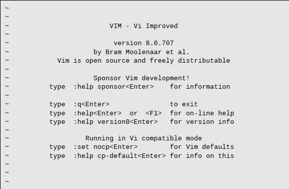
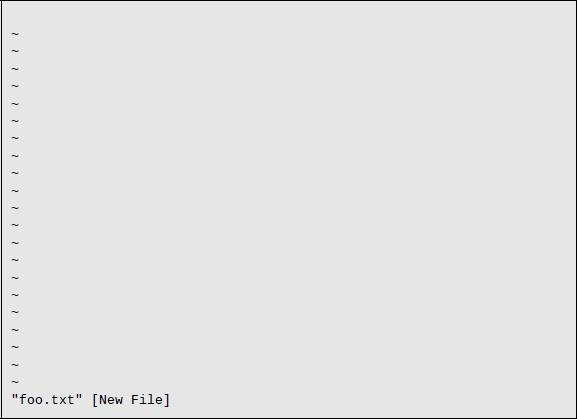

# 12. vi 简明教程

有个旧时的笑话，一个观光客来到纽约，问一个过路人如何去著名的古典音乐厅：

访客：对不起，我怎么去卡内基音乐厅？

路人：练习，练习，练习！

学习 Linux 命令行，和要成为技艺精湛的钢琴家一样，不是在一个下午要去学的东西，而是要花费多年的练习。在本章中，我们将介绍 `vi`（读作「vee  eye」）文本编辑器，一个在 Unix 传统中的核心程序。`vi` 以其难学的用户界面而知名，但是当我们看到一个大师坐在键盘边上开始「演奏」的时候，就会真正见证伟大的艺术。在本章中我们不想要成为大师，当结束本章之后，将知道如何在 `vi` 用「筷子」。

## 为何要学习 vi

在当前这个既有图形编辑器又有易用如 `nano` 的文本编辑器的时代，为何我们要学 `vi`？这里有三条理由。

- `vi` 几乎总是可用。如果我们的系统没有图形界面，`vi` 就像是一个救生圈，比如一台远程服务器或没有被正确配置 X 的本地系统。`nano` 正在越来越大众化，但是还不够通用。`POSIX` 是 Unix 系统上程序兼容性的标准，它要求 `vi` 存在。
- `vi` 轻量且快速。对于多数任务，相比找到菜单里的图形文本编辑器并等待其装载几兆字节的文件来说，`vi` 更易于打开。另外，`vi` 专为快速打字设计。如我们将要看到的，熟练的 `vi` 用户不会在编辑时将其手指从键盘上抬起。
- 我们不想让其他 Linux 用户觉得我们是懦夫。

好吧，就算两条理由吧。

## 一点背景

初版 `vi` 由 Bill Joy 在 1976 年写就，他是加利福尼亚大学伯克利分校的学生，日后成为太阳微系统（Sun Microsystems）的共同创始人之一。`vi` 的名字源自单词「visual」，因为它旨在允许使用移动光标在视频终端上进行编辑。在<u>可视编辑器</u>（*visual editors*）之前，是在一个时间内仅可操作单行文本的<u>行编辑器</u>（*line editors*）。要指定一处变更，我们要告知行编辑器到指定行并描述作何种变更，如增加或删除文本等。随着视频终端的到来（相比较打印终端如电子打字机），可视编辑成为可能。`vi` 实际上合并了一个功能强大的行编辑器 `ex`，所以我们在用 `vi` 的时候，也可以使用行编辑器命令。

大多数 Linux 发行版并不包含真正的 `vi`，而是装载着一个增强替换版 `vim`（即「vi improved」的简称），由 Bram Moolenaar 写就。`vim` 在传统的 Unix `vi` 上作了大量改进，通常被符号链接（或别名化）为 Linux 系统中的 `vi`。在以下的讨论中，我们将假定我们所说的 `vi` 实际上是 `vim` 程序。

## 启动与结束 vi

要启动 `vi`，我们简单地键入：

```bash
[me@linuxbox ~]$ vi
```

将会显示如下屏幕：



和我们之前用 `nano` 一样，第一个要学的是如何退出。键入下列命令（注意冒号是命令的一个组成部分）：

```bash
:q
```

将返回 Shell 提示符。如果因为某些原因，`vi` 没有退出（通常是因为我们对一个文件作了些更改单没有保存），我们可以加一个感叹号来告诉 `vi` 我们真的要退出。

```bash
:q!
```

> **技巧：**如果在 `vi` 中迷路了，试着按两次 `Esc`。

> **兼容模式**
>
> 在上面的启动画面中，我们看到「Running in Vi compatible mode」字样，是说 `vim` 将运行在一个更接近 `vi` 的正常行为，而非 `vim` 的增强行为的模式中。出于本章中所需要，我们将让 `vim` 运行其增强行为。有几个选项可以做到这点。试着运行 `vim` 而非 `vi`，如果能成功，就考虑将 `alias vi='vim'` 加入到你的 `.bashrc` 文件中。或者，用下列命令加入一行到你的 `vim` 配置文件中：
>
> `echo "set nocp" >> ~/.vimrc`
>
> 不同的 Linux 发行版有不同的 `vim` 封装方式。有些默认安装了一个最小版本的仅支持有限的 `vim` 特性。在下列课程中，你可能会遇到那些丢失了的特性，为此，请安装完整版本的 `vim`。

## 编辑模式

再次启动 `vi`，这次传递给它一个不存在的文件名。我们通过这种方法用 `vi` 创建一个新文件：

```bash
[me@linuxbox ~]$ rm -f foo.txt
[me@linuxbox ~]$ vi foo.txt
```

如果一切顺利，会看到一个屏幕：



行首波浪号（`~`）指示该行内没有文本。显示我们有一个空文件。**不要键入任何字符！**

学习 `vi` 第二重要的（在学习了如何退出之后）是 `vi` 是一个<u>模式编辑器</u>（*modal editor*）。`vi` 启动时，进入的是<u>命令模式</u>（*command mode*）。在此模式中，几乎每一个键都是一个命令，所以如果我们开始打字，`vi` 基本上会变得疯狂而制造出一堆混乱。

### 进入插入模式

要在文件中添加一些文本，我们必须首先进入<u>插入模式</u>（*insert mode*），我们可以按 `i` 键来做到这一点。随后，如果 `vim` 正在其通常的增强模式中运行（而非在 `vi` 兼容模式）的话，应该可以在屏幕底端看到这个：

```bash
-- INSERT --
```

现在我们就可以输入一些文本了。试下这个：

```bash
The quick brown fox jumped over the lazy dog.
```

要退出插入模式回到命令模式，请按 `Esc` 键。

### 保存工作

要保存刚才对文件的变更，必须要在命令模式中键入一个 <u>ex 命令</u>（*ex command*）。按 `:` 键可以轻松做到。之后，一个冒号会出现在屏幕下端：

```bash
:
```

要将我们所作的修改写入文件，在冒号之后键入 `w` 然后按 `Enter` 键。

```bash
:w
```

文件将被写入硬盘，我们会在屏幕下方得到一个确认信息，如下所示：

```bash
"foo.txt" [New] 1L, 46C written
```

> **提示：**如果阅读 `vim` 文档，你会注意到（令人困惑地），命令模式被称为<u>普通模式</u>（*normal mode*），而 `ex` 命令被称为<u>命令模式</u>（*command mode*）。要小心。

## 到处移动光标

在命令模式中，`vi` 提供了大量的移动命令，有部分命令和 `less` 命令相同。表 12-1 列出了一个子集。

表 12-1：光标移动键

| 键                      | 光标移动                                               |
| ----------------------- | ------------------------------------------------------ |
| `l` 或向右箭头键        | 右移一个字符。                                         |
| `h` 或向左箭头键        | 左移一个字符。                                         |
| `j` 或向下箭头键        | 移动到下一行。                                         |
| `k` 或向上箭头键        | 移动到上一行。                                         |
| `0`（零）               | 移动到当前行首。                                       |
| `^`                     | 移到到当前行第一个非空白字符。                         |
| `$`                     | 移动到当前行的末尾。                                   |
| `w`                     | 移动到下个单词或标点符号的开头。                       |
| `W`                     | 移动到下个单词的开头，忽略标点符号。                   |
| `b`                     | 移动到前个单词或标点符号的开头。                       |
| `B`                     | 移动到前个单词的开头，忽略标点符号。                   |
| `Ctrl-f` 或 `Page Down` | 移动到下一页                                           |
| `Ctrl-b` 或 `Page Up`   | 移动到上一页                                           |
| *number*`G`             | 移动到第 *number* 行。例如 `1G` 将移动到文件的第一行。 |
| `G`                     | 移动到文件末尾行。                                     |

为何 `h`、`j`、`k`、`l` 被用作光标移动？当最初编写 `vi` 时，没有视频终端，也没有箭头键，熟练的打字员可以使用常规键盘键来移动光标而不需要从键盘上抬起手指。

`vi` 中很多命令可以加一个数字前缀，如表中的 `G` 命令。通过前缀数字，我们可以指定一个命令被执行的次数。例如 `5j` 命令将导致 `vi` 向下移动五行。

## 基本编辑

大部分编辑由一些基本操作构成，如插入文本、删除文本和剪切粘贴文本。`vi` 当然也以其独特的方法支持这些操作。`vi` 也提供有限的撤销操作。如果在命令模式中按 `u` 键，`vi	` 会撤销上一次所作的变更。当我们尝试一些基本编辑命令时，这会给我们带来一点便利。

### 附加文本

`vi` 有几种不同的方法来进入插入模式。我们已经用过 `i` 命令来插入文本了。

让我们回到 `foo.txt` 文件。

```bash
The quick brown fox jumped over the lazy dog.
```

如果想在句子末尾加一些文本，我们将发现 `i` 命令做不到这一点，因为我们不能将光标移动到行末位置。`vi` 提供了一个命令用以<u>附加</u>（*append*）文本，合理地被命名为 `a`。如果我们移动到行末并按 `a`，光标会移动到行末，`vi` 会进入插入模式。允许我们添加更多的文本。

```bash
The quick brown fox jumped over the lazy dog. It was cool.
```

记得按 `Esc` 退出插入模式。

由于我们几乎总是想要在行末处添加文本，`vi` 提供了一个快捷方式，以移动到行末并添加文本。就是 `A` 命令。让我们试着在文件中添加更多的行。

首先，我们用 `0` 命令移动光标到行首。现在按 `A` 来添加下列文本：

```bash
The quick brown fox jumped over the lazy dog. It was cool.
Line 2
Line 3
Line 4
Line 5
```

再次按 `Esc` 退出插入模式。

我们可以看到，`A` 更有效地移动光标到行末并开启插入模式。

### 开启一行

另一个插入文本的方式是「开启」一行。它会在两行已经存在的文本之间插入新的空白行。有两种变化，如表 12-2。

表 12-2：行操作键

| 命令 | 开启                   |
| ---- | ---------------------- |
| `o`  | 在当前行之下插入新行。 |
| `O`  | 在当前行之上插入新行。 |

可以来演示一下，光标停留在「Line 3」，然后按 `o`。

```bash
The quick brown fox jumped over the lazy dog. It was cool.
Line 2
Line 3

Line 4
Line 5
```

就在第三行下开启了新行，并进入了插入模式。按 `Esc` 退出插入模式。按 `u` 撤销所作的变更。

按 `O` 键在光标上方开启新行。

```bash
The quick brown fox jumped over the lazy dog. It was cool.
Line 2

Line 3
Line 4
Line 5
```

按 `Esc` 退出插入模式。按 `u` 撤销所作的变更。

### 删除文本

如我们所期望的，`vi` 提供了多种途径以删除文本，每个都包含了一次或两次击键。首先，`x` 命令将删除光标位置的一个字符。可以在 `x` 前置数字来指定要删除多少字符。`d` 命令功能更强，如 `x` 一样，可以前置数字来指定删除多少次数。另外，`d` 总是跟随着一个移动命令来控制删除的范围。表 12-3 提供了一些示例：

表 12-3：文本删除命令

| 命令   | 删除                                 |
| ------ | ------------------------------------ |
| `x`    | 当前字符                             |
| `3x`   | 当前字符和随后的两个字符             |
| `dd`   | 当前行                               |
| `5dd`  | 当前行及其下四行                     |
| `dW`   | 从当前光标位置到下一个单词的开始处   |
| `d$`   | 从当前光标位置到当前行末尾处         |
| `d0`   | 从当前光标位置到当前行起始处         |
| `d^`   | 从当前光标位置到行首第一个非空白字符 |
| `dG`   | 从当前行到文件末尾                   |
| `d20G` | 从当前行到文件的第 20 行             |

将光标置于文本的首行中的 `It` 处。重复按 `x` 键，将句子中剩余的字符全部删除。然后重复按 `u` 键直到撤销全部删除动作。

> **注意：**`vi` 仅支持一次撤销。`vim` 支持多次撤销。

再来尝试删除，这次用 `d` 命令。移动光标到 `It` 然后按 `dW` 删除一个单词。

```bash
The quick brown fox jumped over the lazy dog. was cool.
Line 2
Line 3
Line 4
Line 5
```

键入 `d$`，删除从光标位置到行末的所有字符。

```bash
The quick brown fox jumped over the lazy dog.
Line 2
Line 3
Line 4
Line 5
```

按 `dG`，删除当前行到文件末尾的所有行。

```bash
~
~
~
~
~
```

按三次 `u`，撤销删除动作。

### 剪切、复制、粘贴文本

`d` 命令不仅能删除文本，还能「剪切」文本。每次用 `d` 命令所删除的文本，都会被复制到了一个粘贴缓冲区（可以想象为剪贴板），我们可以用 `p` 命令将其粘贴到光标位置之后，或者用 `P` 命令将其粘贴到光标位置之前。

`y` 命令用于「猛拉 yank」（复制 copy）文本，其方式与使用 `d` 命令剪切文本的方式非常相似。表 12-4 提供了一些 `y` 命令的各种移动组合变化。

表 12-4：复制命令

| 命令  | 复制                               |
| ----- | ---------------------------------- |
| `yy`   | 当前行                               |
| `5yy`  | 当前行及其下四行                     |
| `yW`   | 从当前光标位置到下一个单词的开始处   |
| `y$`   | 从当前光标位置到当前行末尾处         |
| `y0`   | 从当前光标位置到当前行起始处         |
| `y^`   | 从当前光标位置到行首第一个非空白字符 |
| `yG`   | 从当前行到文件末尾                   |
| `y20G` | 从当前行到文件的第 20 行             |

让我们尝试一下复制粘贴。将光标置于首行，键入 `yy` 以复制当前行。然后按 `G` 移动光标到末行，键入 `p` 以粘贴到当前行之下。

```bash
The quick brown fox jumped over the lazy dog. It was cool.
Line 2
Line 3
Line 4
Line 5
The quick brown fox jumped over the lazy dog. It was cool.
```

如之前的操作，按 `u` 撤销更改。光标还定位在文件中的末行，按 `P` 将文本粘贴到当前行之上。

```bash
The quick brown fox jumped over the lazy dog. It was cool.
Line 2
Line 3
Line 4
The quick brown fox jumped over the lazy dog. It was cool.
Line 5
```

尝试一下在表 12-4 中所列的 `y` 命令，理解 `p` 和 `P` 命令的行为。完成测试之后，将文件回退到原始状态。

### 连接行

`vi` 对于行的概念是相当严格的。通常，不可能通过移动光标到行末并删掉<u>行结束字符</u>（end-of-line character）的方式将当前行与下一行连接在一起。所以，`vi` 提供了一个专用命令 `J`（不要和向下移动的命令 `j` 混淆）以连接行。

如果我们将光标置于 `Line 3` 并按 `J` 命令，看一下发生了什么：

```bash
The quick brown fox jumped over the lazy dog. It was cool.
Line 2
Line 3 Line 4
Line 5
```

## 查找与替换

`vi` 有基于查找来移动光标的能力。它可以对单行文本，也可以对整个文件来查找。同时也可以执行文本替换，无论是否需要用户确认。

### 行内检索

`f` 命令检索行内文本并移动光标到下一个指定字符处。如 `fa` 将光标移动到行内下一个 `a` 出现的地方。当完成一次检索后，可以键入分号 `;` 重复检索。

### 全文检索

要移动光标到某个单词或词组的下一次出现的地方，要用到 `/` 命令。这在之前学到的 `less` 程序中也同样奏效。当你键入 `/` 命令，一个 `/` 将出现在屏幕下方。随后键入要检索的单词或词组，并按 `Enter` 键。光标会移动到包含检索字符串的下一个位置。键入 `n` 可以重复上一次检索。如下例：

```bash
The quick brown fox jumped over the lazy dog. It was cool.
Line 2
Line 3
Line 4
Line 5
```

将光标置于文件第一行，键入下列字符并按 `Enter` 键：

```bash
/Line
```

光标会移动到第二行，然后按 `n`，光标会移动到第三行。重复 `n` 命令将向下移动光标，直到找不到匹配项。到目前为止，我们用到的都是以单词或词组作为检索的模式，`vi` 还允许我们用<u>正则表达式</u>（*regular expressions*），一个功能强大的复杂文本表达模式。我们将在第 19 章学习到。

### 全局查找与替换

`vi` 使用 ex 命令以执行多行或整个文件的查找替换操作（在 `vi` 中被称为<u>替代</u> *substitution*）。要将整个文件中的 `Line` 替换成 `line`，需要键入下列命令：

```bash
:%s/Line/line/g
```

让我们分解这个命令，看下各个项目分别做了什么（见表 12-5）。

表 12-5：一个全局查找与替换示例的句法

| 项目         | 意义                                                         |
| ------------ | ------------------------------------------------------------ |
| `:`          | 冒号字符开启一个 ex 命令。                                   |
| `%`          | 指定操作的行的范围。`%` 是个快捷键，意味着从首行到末行。或者，范围可以指定为 `1,5`（由于我们的文件是共有五行），或者，可以是 `1,$`，意思是「从第一行到文件的最后一行」。如果省略了行范围，操作将仅仅限于当前行。 |
| `s`          | 指定的操作。在这里，是替代（查找与替换）。                   |
| `/Line/line` | 指定查找的模式和替换文本。                                   |
| `g`          | 意为「global」。意味着在行中的搜索字符串的每个实例上执行搜索和替换。如果省略，仅替换每行中第一个实例。 |

执行完查找替换命令之后，我们的文件看起来就像这样了：

```bash
The quick brown fox jumped over the lazy dog. It was cool.
line 2
line 3
line 4
line 5
```

我们还可以指定替换命令需要用户确认。可以在命令之后加个 `c`。例如：

```bash
:%s/line/Line/gc
```

这条命令框会把文件改成原来的模样，不过，每次替换前，`vi` 先暂停然后用下面这条命令询问我们确认替代：

```bash
replace with Line (y/n/a/q/l/^E/^Y)?
```

括号中每个字符都是一个可能的选择，在表 12-6 中详述。

表 12-6：替换确认键

| 键                | 行为                                             |
| ----------------- | ------------------------------------------------ |
| `y`               | 执行替换。                                       |
| `n`               | 忽略本模式的该实例。                             |
| `a`               | 执行本次及后续所有实例的替换。                   |
| `q` 或 `Esc`      | 退出替换。                                       |
| `l`               | 执行完本次替换就退出。这是「last」的缩写。       |
| `Ctrl-e` `Ctrl-y` | 分别为向下和向上滚动。便于查看建议替代的上下文。 |

如果按 `y`，将会执行替换，按 `n`，`vi` 将忽略该实例并移动到下个实例。

## 编辑多个文件

在同一时间编辑多个文件通常很有用。你可能需要变更多个文件，或者要从一个文件中复制内容到另一个文件。用 `vi` 我们能打开多个文件以供编辑。

```bash
vi file1 file2 file3...
```

让我们退出当前 `vi` 会话，创建一个新文件以供编辑。键入 `:wq` 退出 `vi` 以保存我们修改的文本。然后在家目录中创建另一个文件，供我们学习。我们将捕获一些  `ls` 命令的输出以创建文件。

```bash
[me@linuxbox ~]$ ls -l /usr/bin > ls-output.txt
```

用 `vi` 来编辑我们的旧文件和新文件。

```bash
[me@linuxbox ~]$ vi foo.txt ls-output.txt
```

`vi` 将会启动，我们将在屏幕上看到第一个文件。

```bash
The quick brown fox jumped over the lazy dog. It was cool.
Line 2
Line 3
Line 4
Line 5
```

### 在文件间切换

从一个文件切换到下一个文件，用这个 ex 命令：

```bash
:bn
```

移动到前一个文件，用下列命令：

```bash
:bp
```

当我们从一个文件切换到另一文件时，如果当前文件没有保存变更的话，`vi` 会有强制策略来阻止我们。要强制 `vi` 切换文件并放弃所作更改，需要在命令之后加一个感叹号（`!`）。

在上述切换方法之外，`vim`（和某些版本的 `vi`）提供了一些 ex 命令，使管理多个文件的时候更方便。我们可以用 `:buffers` 命令查看正在编辑的文件清单。这样做会在命令下端显示文件清单。

```bash
:buffers
  1 %a "foo.txt"            line 1
  2    "ls-output.txt"      line 0
Press ENTER or type command to continue
```

要切换到另一个缓冲区（文件），键入 `:buffer` 和想要编辑的缓冲区编号。例如，从 `1` 号 `foo.txt` 切换到 `2` 号 `ls-output.txt`，需要键入：

```bash
:buffer 2
```

现在，屏幕上显示第二个文件了。另一个切换文件的办法，就是之前介绍过的 `:bn`（buffer next）和 `:bp`（buffer previous）。

### 打开附加文件以编辑

还可以将文件加入到正在编辑的会话中。ex 命令 `:e`（edit）后接文件名，将打开另一个文件。让我们结束当前编辑会话，回到命令行。

再次开启 `vi`，这次只是打开一个文件。

```bash
[me@linuxbox ~]$ vi foo.txt
```

要加入第二个文件，键入：

```bash
:e ls-output.txt
```

它将显示在屏幕上。而第一个文件现在还存在着，可以验证一下。

```bash
:buffers
  1    "foo.txt"            line 1
  2 %a "ls-output.txt"      line 0
Press ENTER or type command to continue
```

### 从一个文件中复制内容到另一文件

在编辑多个文件时，我们经常要将一个文件的部分复制到另一个正在编辑的文件中。使用通常的复制粘贴命令，很容易做到。我们可以演示如下。首先用我们的两个文件，切换到缓冲区 `1`（`foo.txt`）：

```bash
:buffer 1
```

会得到：

```bash
The quick brown fox jumped over the lazy dog. It was cool.
Line 2
Line 3
Line 4
Line 5
```

接下来，移动光标到第一行，键入 `yy` 复制该行。

切换到第二个缓冲区：

```bash
:buffer 2
```

屏幕将显示一些文件清单（这里仅显示部分）：

```bash
total 343700
-rwxr-xr-x 1 root root  31316 2017-12-05 08:58 [
-rwxr-xr-x 1 root root   8240 2017-12-09 13:39 411toppm
-rwxr-xr-x 1 root root 111276 2018-01-31 13:36 a2p
-rwxr-xr-x 1 root root  25368 2016-10-06 20:16 a52dec
-rwxr-xr-x 1 root root  11532 2017-05-04 17:43 aafire
-rwxr-xr-x 1 root root   7292 2017-05-04 17:43 aainfo
```

移动光标到第一行，并用 `p` 命令粘贴之前复制的那行文字。

```bash
total 343700
The quick brown fox jumped over the lazy dog. It was cool.
-rwxr-xr-x 1 root root  31316 2017-12-05 08:58 [
-rwxr-xr-x 1 root root   8240 2017-12-09 13:39 411toppm
-rwxr-xr-x 1 root root 111276 2018-01-31 13:36 a2p
-rwxr-xr-x 1 root root  25368 2016-10-06 20:16 a52dec
-rwxr-xr-x 1 root root  11532 2017-05-04 17:43 aafire
-rwxr-xr-x 1 root root   7292 2017-05-04 17:43 aainfo
```

### 将整个文件插入到另一文件

还可以将整个文件插入到我们正在编辑的文件。要查看这个行为，先结束之前的 `vi` 会话，重新开启单个文件的会话。

```bash
[me@linuxbox ~]$ vi ls-output.txt
```

再次看到文件清单。

```bash
total 343700
-rwxr-xr-x 1 root root  31316 2017-12-05 08:58 [
-rwxr-xr-x 1 root root   8240 2017-12-09 13:39 411toppm
-rwxr-xr-x 1 root root 111276 2018-01-31 13:36 a2p
-rwxr-xr-x 1 root root  25368 2016-10-06 20:16 a52dec
-rwxr-xr-x 1 root root  11532 2017-05-04 17:43 aafire
-rwxr-xr-x 1 root root   7292 2017-05-04 17:43 aainfo
```

移动光标到第三行，键入下列 ex 命令：

```bash
:r foo.txt
```

`r` 命令（read）将指定文件插入到光标之下。屏幕将显示为：

```bash
total 343700
-rwxr-xr-x 1 root root  31316 2017-12-05 08:58 [
-rwxr-xr-x 1 root root   8240 2017-12-09 13:39 411toppm
The quick brown fox jumped over the lazy dog. It was cool.
Line 2
Line 3
Line 4
Line 5
-rwxr-xr-x 1 root root 111276 2018-01-31 13:36 a2p
-rwxr-xr-x 1 root root  25368 2016-10-06 20:16 a52dec
-rwxr-xr-x 1 root root  11532 2017-05-04 17:43 aafire
-rwxr-xr-x 1 root root   7292 2017-05-04 17:43 aainfo
```

## 保存工作

和其它程序一样，`vi` 有好些方法保存我们编辑过的文件。我们已经学过 `:w` 命令，但其它命令或许会更有用。

在命令模式中，按 `ZZ` 会保存当前文件并退出 `vi`。类似的 ex 命令是 `:wq`，将 `:w` 和 `:q` 合并到一个命令中，将保存文件并退出。

`:w` 命令还能指定一个可选的文件名。该行为类似「另存为...」。如我们正在编辑 `foo.txt` 并想要保存一个替代版本 `foo1.txt`，可以键入如下命令：

```bash
:w foo1.txt
```

> 注意：当文件以另一个文件名保存时，正在编辑的文件本身并不会更改。当我们继续编辑时，依旧在编辑 `foo.txt` 而非 `foo1.txt`。

## 总结

有了这些基本技能，我们就可以执行大多数的文本编辑以维护一个典型的 Linux 系统。从长远来看，学习定期使用 `vim` 会获得回报。因为 vi 风格的编辑器是如此深入的整合在 Unix 文化中，我们将会看到许多其它程序也受其风格影响。`less` 就是这种影响的好示例。

## 扩展阅读

我们本章中所学的，仅仅触及 `vi` 和 `vim` 的表面。这里有一堆线上资源可以供你使用，继续你的 `vi` 征服之旅：

- Vim, with Vigor——一个在 LinuxCommand.org 接续本章的教程，可以培养读者到中级技能。http://linuxcommand.org/lc3_adv_vimvigor.php
- Learning The vi Editor——维基百科提供的百科图书，提供了 `vi` 简明教程。http://en.wikibooks.org/wiki/Vi
- The Vim Book—— `vim` 项目的 570 页的书，覆盖了几乎所有的 `vim` 特性。ftp://ftp.vim.org/pub/vim/doc/book/vimbook-OPL.pdf
- 一个关于 `vi` 作者 Bill Joy 的维基百科条目：http://en.wikipedia.org/wiki/Bill_Joy
- 一个关于 `vim` 作者 Bram Moolenaar 的维基百科条目：http://en.wikipedia.org/wiki/Bram_Moolenaar

